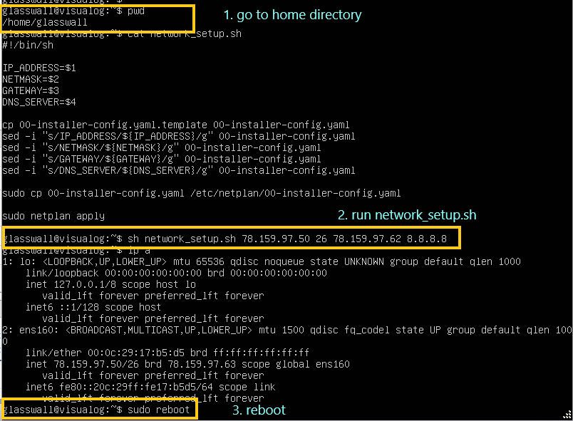
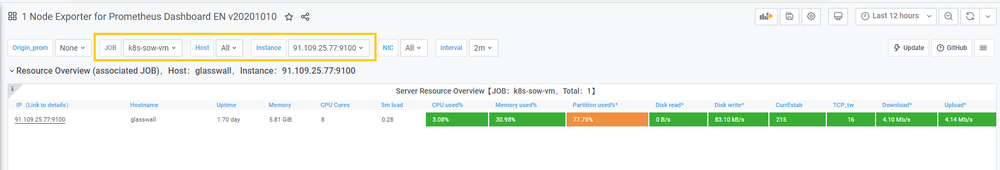

## Monitoring OVA Import

* 1. [Download OVA](#DownloadOVA)
* 2. [Launch a VM instance](#LaunchaVMinstance)
* 3. [Configure Network](#ConfigureNetwork)
	* 3.1. [Manual configuration](#Manualconfiguration)
	* 3.2. [Scripted configuration](#Scriptedconfiguration)
	* 3.3. [Check outgoing connection](#Checkoutgoingconnection)
	* 3.4. [Check incoming connection](#Checkincomingconnection)
* 4. [Configure metrics monitoring](#Configuremetricsmonitoring)
	* 4.1. [Monitor Server metrics](#MonitorServermetrics)
		* 4.1.1. [Find the IP Address of ICAP server](#FindtheIPAddressofICAPserver)
		* 4.1.2. [Edit file /etc/prometheus/prometheus.yml](#Editfileetcprometheusprometheus.yml)
		* 4.1.3. [Restart prometheus service](#Restartprometheusservice)
		* 4.1.4. [Server metrics should be available in the dashboard](#Servermetricsshouldbeavailableinthedashboard)
* 5. [Configure kibana](#Configurekibana)
	* 5.1. [Edit Kibana IP Address](#EditKibanaIPAddress)

# How to use monitoring ova
##  1. <a name='DownloadOVA'></a>Download OVA
The OVA is available at this location [s3://glasswall-sow-ova/vms/visualog/visualog.ova](s3://glasswall-sow-ova/vms/visualog/visualog.ova)
##  2. <a name='LaunchaVMinstance'></a>Launch a VM instance
Use ESXi to launch an instance using above OVA
##  3. <a name='ConfigureNetwork'></a>Configure Network
###  3.1. <a name='Manualconfiguration'></a>Manual configuration
Update the IP Address, Netmask and Gateway in file /etc/netplan/00-installer-config.yaml
###  3.2. <a name='Scriptedconfiguration'></a>Scripted configuration
Use network_setup.sh. 
```
    sh network_setup.sh IP_ADDRESS NETMASK GATEWAY DNS_SERVER
    reboot
```
See the screenshot below:

[]

###  3.3. <a name='Checkoutgoingconnection'></a>Check outgoing connection
```
    ping 8.8.8.8
``` 
###  3.4. <a name='Checkincomingconnection'></a>Check incoming connection
```
    telnet VM_IP_ADDRESS 9200
```
##  4. <a name='Configuremetricsmonitoring'></a>Configure metrics monitoring 
Note: this is temporary solution until push method is used for metrics monitoring. It shouldn't be needed anymore in the next OVA releases that use push method.
###  4.1. <a name='MonitorServermetrics'></a>Monitor Server metrics 
####  4.1.1. <a name='FindtheIPAddressofICAPserver'></a>Find the IP Address of ICAP server 
####  4.1.2. <a name='Editfileetcprometheusprometheus.yml'></a>Edit file /etc/prometheus/prometheus.yml 
To add a monitoring job for the ICAP server, replace the ```ICAP_SERVER_NAME``` and ```ICAP_IP_ADDRESS``` with the name and the IP of the ICAP server.
```
scrape_configs:
   - job_name: ICAP_SERVER_NAME
     scrape_interval: 5s
     static_configs:
     - targets: ['ICAP_IP_ADDRESS:9100']
```
####  4.1.3. <a name='Restartprometheusservice'></a>Restart prometheus service
```
	sudo systemctl restart prometheus
```
####  4.1.4. <a name='Servermetricsshouldbeavailableinthedashboard'></a>Server metrics should be available on the dashboard
See the screenshot.

[]

##  5. <a name='Configurekibana'></a>Configure kibana
###  5.1. <a name='EditKibanaIPAddress'></a>Edit Kibana IP Address
Open file /etc/kibana/kibana.yaml and replace the value of ```server.host``` to the IP Address of the monitoring VM.
