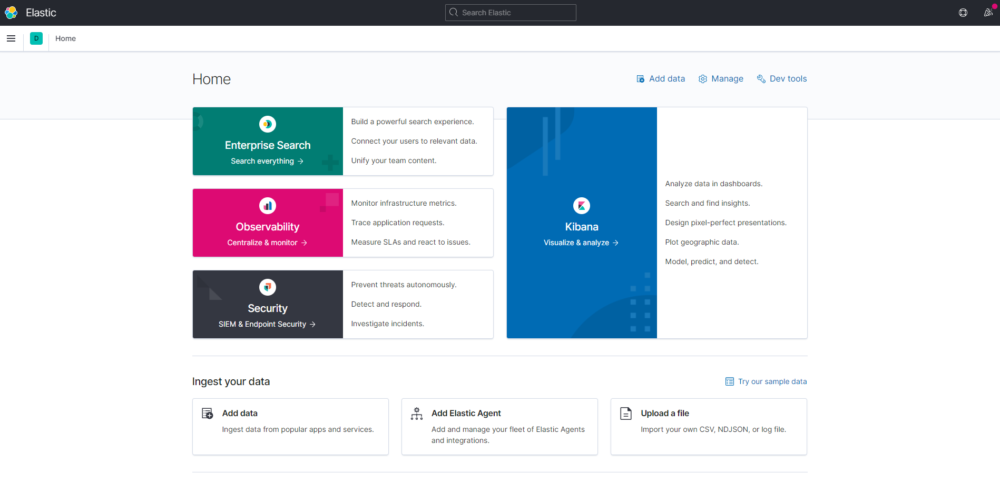
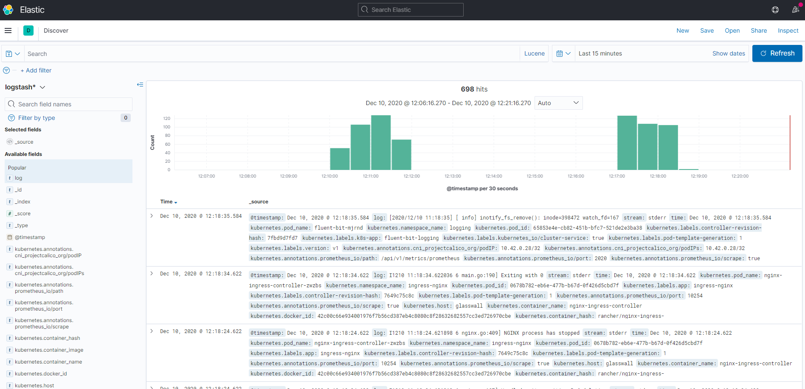
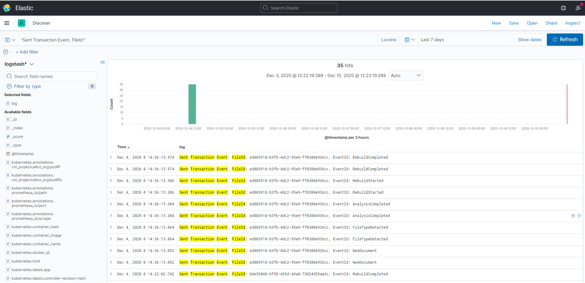
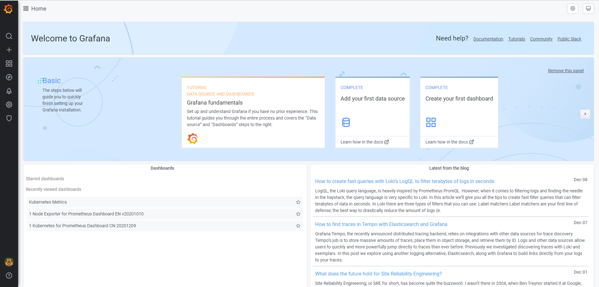
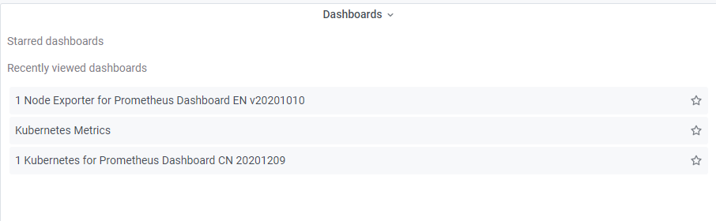
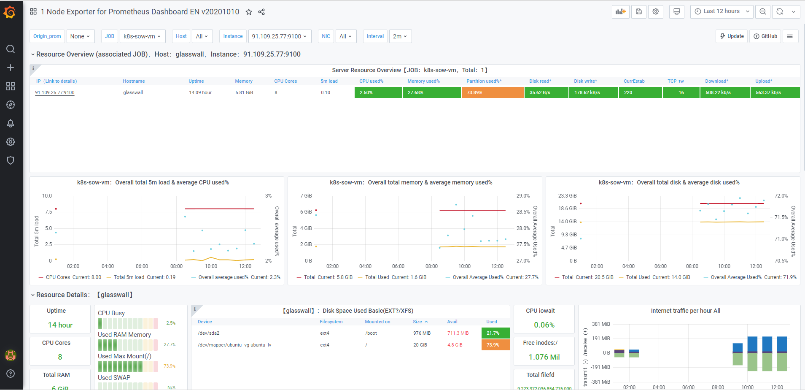
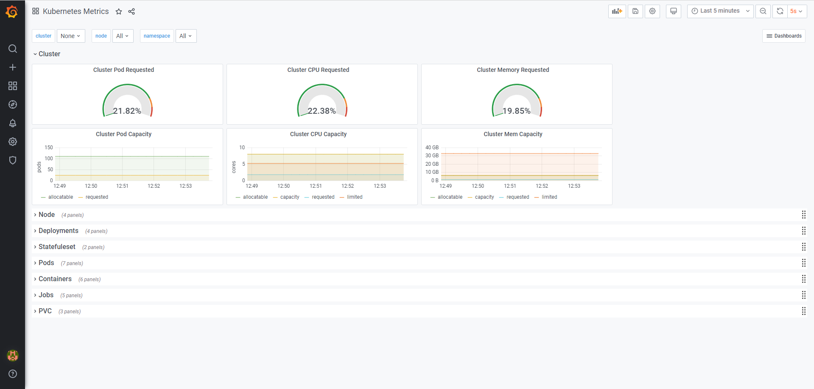

## Monitoring OVA Usage

* 1. [Open Kibana](#OpenKibana)
	* 1.1. [Find all logs from a VM](#FindalllogsfromaVM)
	* 1.2. [Find logs based on query](#Findlogsbasedonquery)
* 2. [Open Grafana](#OpenGrafana)
	* 2.1. [Check metrics from a VM](#CheckmetricsfromaVM)
	* 2.2. [Check metrics from a k8s cluster](#Checkmetricsfromak8scluster)
* 3. [Application Tracing](#ApplicationTracing)

# Logging
##  1. <a name='OpenKibana'></a>Open Kibana
Open URL: [http://OVA_IP_ADDRESS:5601]

###  1.1. <a name='FindalllogsfromaVM'></a>Find all logs from a VM
- Navigate to Home > Kibana > Discover
- Open Index logstash
- Screenshot

###  1.2. <a name='Findlogsbasedonquery'></a>Find logs based on query 
- Navigate to Search field
- Type ```"Sent Transaction Event, FileId:"``` with the double-quote included.
- Change the timeline to the desired length, e.g. Last 7 days
- Click ```Refresh``` button
- Screenshot

# Metrics
##  2. <a name='OpenGrafana'></a>Open Grafana
- Open URL: [http://OVA_IP_ADDRESS:3000]
- Use credentials:
Username: admin
Password: ****** (please ask in the Slack channel)
- Screenshot

###  2.1. <a name='CheckmetricsfromaVM'></a>Check metrics from a VM
- Browse the list of the dashboard

- Choose the ```Node Exporter``` dashboard

###  2.2. <a name='Checkmetricsfromak8scluster'></a>Check metrics from a k8s cluster
- Browse the list of the dashboard

- Choose the ```Kubernetes Metrics``` dashboard

##  3. <a name='ApplicationTracing'></a>Application Tracing
TBD