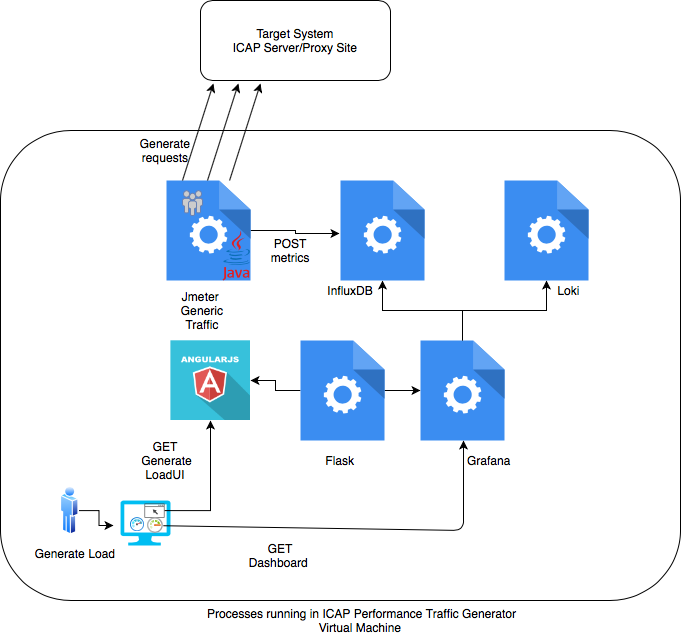
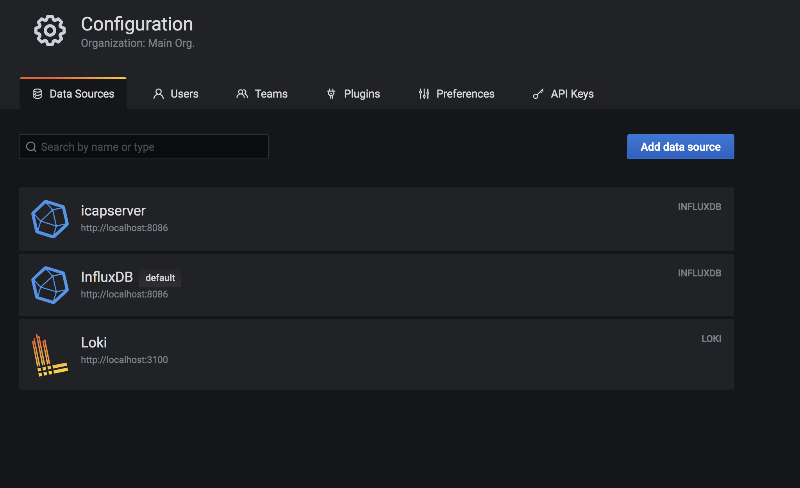

### This MD contains details on how to create Traffic Gen OVA from scratch.


The following instructions will help to setup OVA that will include dashboarding and load generation solutions.
Virtual Machine OS to be used here is Ubuntu 20.04.
Easiest way to create OVA is to setup everything in EC2 instance in AWS and then export EC2 as OVA.

The following diagram shows generic view of what processes are going to run and how are they connected:



## 1. Install Loki

```bash
cd /usr/local/bin
sudo curl -fSL -o loki.gz "https://github.com/grafana/loki/releases/download/v2.0.0/loki-linux-amd64.zip"
sudo gunzip loki.gz
sudo chmod a+x loki
sudo wget https://raw.githubusercontent.com/grafana/loki/master/cmd/loki/loki-local-config.yaml
sudo useradd --system loki
```
Create loki.service file with following content:

```bash
sudo nano /etc/systemd/system/loki.service

[Unit]
Description=Loki service
After=network.target

[Service]
Type=simple
User=loki
ExecStart=/usr/local/bin/loki -config.file /usr/local/bin/loki-local-config.yaml

[Install]
WantedBy=multi-user.target

```

Start loki service and make it run on boot.

```bash
sudo service loki start
sudo service loki status
sudo systemctl enable loki.service
```
# Install ICAP client
```bash
sudo apt-get update
sudo apt-get install c-icap -y
```

## Install InfluxDB

```bash
echo "deb https://repos.influxdata.com/ubuntu bionic stable" | sudo tee /etc/apt/sources.list.d/influxdb.list

curl -sL https://repos.influxdata.com/influxdb.key | sudo apt-key add -
sudo apt-get update
sudo apt-get install influxdb
systemctl start influxdb
systemctl status influxdb
systemctl enable --now influxdb
```
Create needed Influxdb databases ready.

```bash
influx
Connected to http://localhost:8086 version 1.8.3
InfluxDB shell version: 1.8.3
> create database jmeter
> create database icapserver
> exit

```
## Install grafana and setup datasources

```bash

 sudo apt install net-tools

 sudo apt-get install -y gnupg2 curl  software-properties-common
 wget -q -O - https://packages.grafana.com/gpg.key | sudo apt-key add -

 sudo add-apt-repository "deb https://packages.grafana.com/oss/deb stable main"
 sudo apt-get update

 sudo apt-get -y install grafana

 sudo systemctl enable --now grafana-server

 systemctl status grafana-server.service 
```
**Setup datasource**

Open grafana UI in your browser: http://ip:3000/datasources. 
Default credentials is admin/admin. Change it to admin/glasswall, for example.

https://github.com/k8-proxy/aws-jmeter-test-engine/blob/master/jmeter-icap/instructions/How-to-Integrate-Jmeter-With-Influxdb-and-Grafana.md these instructions show how a datasource can be added to Grafana.

There are 3 datasources to be created in Grafana. Click Add Datasource and add the following:

- Source name: InfluxDB, database: jmeter, url: http://localhost:8086
- Source name: icapserver, database: jmeter, url: http://localhost:8086
- Source name: Loki, url: http://localhost:3100



 ## Install Java

```bash
  sudo apt -y install openjdk-8-jdk
```

## Install useful tools
```bash
   sudo apt -y install telnet
   sudo apt -y install unzip
 
```
## Install jmeter and set up data

```bash
sudo mkdir /opt/jmeter
cd /opt/jmeter/
sudo wget https://www.nic.funet.fi/pub/mirrors/apache.org//jmeter/binaries/apache-jmeter-5.3.zip

sudo unzip apache-jmeter-5.3.zip 
```
Create in and out folders
```bash
cd /opt/jmeter/apache-jmeter-5.3/bin
sudo mkdir in
sudo mkdir out
```
Prepara test data in correct place
```bash
cd /opt/git/aws-jmeter-test-engine/jmeter-icap/test-data/
sudo unzip gov_uk_files.zip
```
Move files to jmeter bin/in folder
```bash
cd gov_uk_files
sudo cp -R * /opt/jmeter/apache-jmeter-5.3/bin/in/
```

## Install & Setup git
```bash
cd /opt
sudo mkdir git
sudo apt install git -y
```
Clone repo

```bash
cd git
sudo git clone https://github.com/k8-proxy/aws-jmeter-test-engine.git
```
## Setting UP Generate Load ui

Follow Instructions from https://github.com/k8-proxy/aws-jmeter-test-engine/blob/master/jmeter-icap/instructions/angular-ui-component-install-and-deploy.md link to setup UI.

## Install Promtail and setup as service

```bash
cd /usr/local/bin
sudo curl -fSL -o promtail.gz "https://github.com/grafana/loki/releases/download/v1.6.1/promtail-linux-amd64.zip"

```
```bash
sudo gunzip promtail.gz
```
```bash
sudo chmod a+x promtail
```
Now we will create promtail config file:

```bash
sudo nano config-promtail.yml
```
And add this script,

```bash
server:
  http_listen_port: 9080
  grpc_listen_port: 0
positions:
  filename: /tmp/positions.yaml
clients:
  - url: http://127.0.0.1:3100/loki/api/v1/push
scrape_configs:
- job_name: glasswall_jmeter
  static_configs:
  - targets:
      - glasswall_jmeter
    labels:
      job: glasswall_jmeter
      __path__: "/opt/jmeter/apache-jmeter-5.3/bin/jmeter.log"
```
Create user specifically for the Promtail service
```bash
sudo useradd --system promtail
```
Create a file called promtail.service

and add this script
```bash
sudo nano /etc/systemd/system/promtail.service
```
Add this to the file:

```bash
[Unit]
Description=Promtail service
After=network.target

[Service]
Type=simple
User=promtail
ExecStart=/usr/local/bin/promtail -config.file /usr/local/bin/config-promtail.yml

[Install]
WantedBy=multi-user.target
```
Run the service:
```bash
sudo service promtail start
sudo service promtail status
usermod -a -G systemd-journal promtail
```
Give necessary correct permissions in case if promtail service does not run

```bash
usermod -a -G systemd-journal promtail
chown promtail:promtail /tmp/positions.yaml
```
Set the service autorun during boot:

```bash
sudo systemctl enable promtail.service
```
# Linux tuning & install useful applications

Ulimit tuning.

In order to be able to generate high traffic, there is a need to tune Linux ulimit parameters:

sudo nano /etc/security/limits.conf
 Edit the following file
 ```bash
 sudo nano /etc/sysctl.conf
```
Add & save:
```bash
net.ipv4.ip_local_port_range = 12000 65535
fs.file-max = 1048576
```
Edit the following file:
 ```bash
sudo nano /etc/security/limits.conf
```
Add & Save:
```bash
*           soft      nofile     1048576
*           hard      nofile     1048576
root        soft      nofile     1048576
root        hard      nofile     1048576
```

Reboot & Confirm that changes are in effect:
```bash
[root@ip-10-112-4-96 ec2-user]# ulimit -n
1048576
```
## Add new user with password authentication
Ensure to run the following as root user.

```bash
adduser glasswall
usermod -aG sudo glasswall

```
Modify sshd config to allow 
```bash
sudo nano /etc/ssh/sshd_config
```
Ensure that 
```bash
PasswordAuthentication yes
```
```bash
service ssh restart
```
try new user

```bash
su - glasswall
```
## Export EC2 as OVA.

-Ensure that aws cli v2 is setup with access to AWS. 
-S3 bucket is created 
-Attach an access control list (ACL) to your S3 bucket containing the following grants. 
-For Grantee, provide the appropriate Region-specific canonical account ID:
```bash
All other Regions
c4d8eabf8db69dbe46bfe0e517100c554f01200b104d59cd408e777ba442a322
```
-Create files.json with the following content:
```bash
{
    "ContainerFormat": "ova",
    "DiskImageFormat": "VMDK",
    "S3Bucket": "change-bucket-name",
    "S3Prefix": "vms/"
}
```
-run the following command
```bash
aws ec2 create-instance-export-task --instance-id instance-id --target-environment vmware --export-to-s3-task file://C:\file.json
```
More information about how to export EC2 as OVA can be found in:
https://docs.aws.amazon.com/vm-import/latest/userguide/vmexport.html


