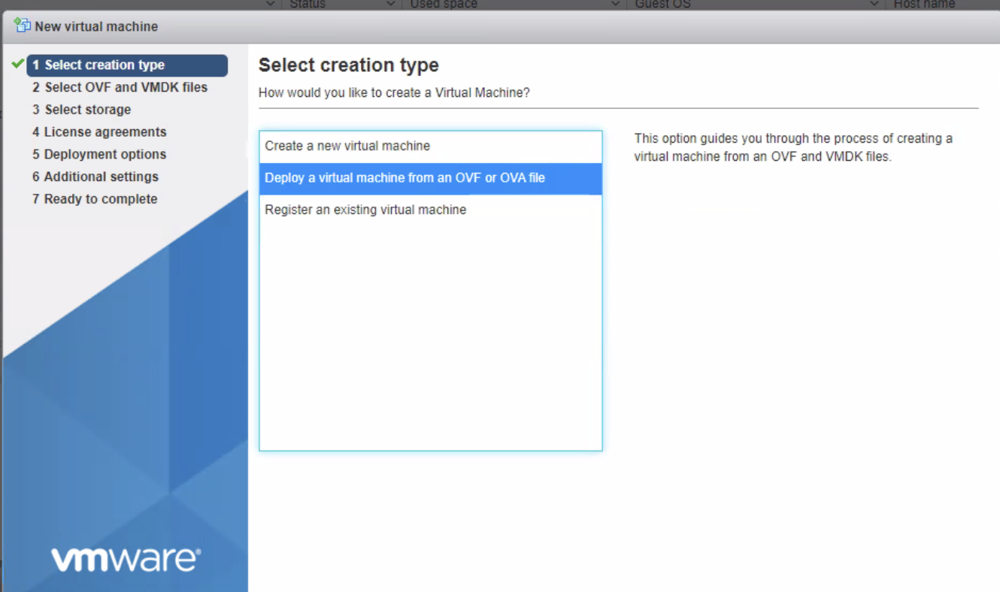
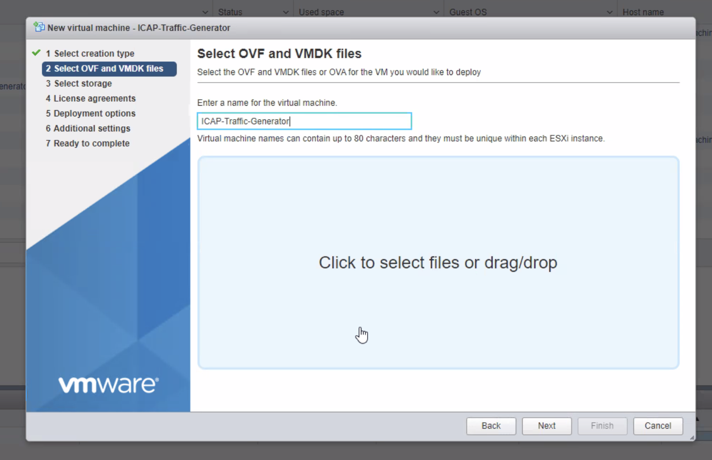
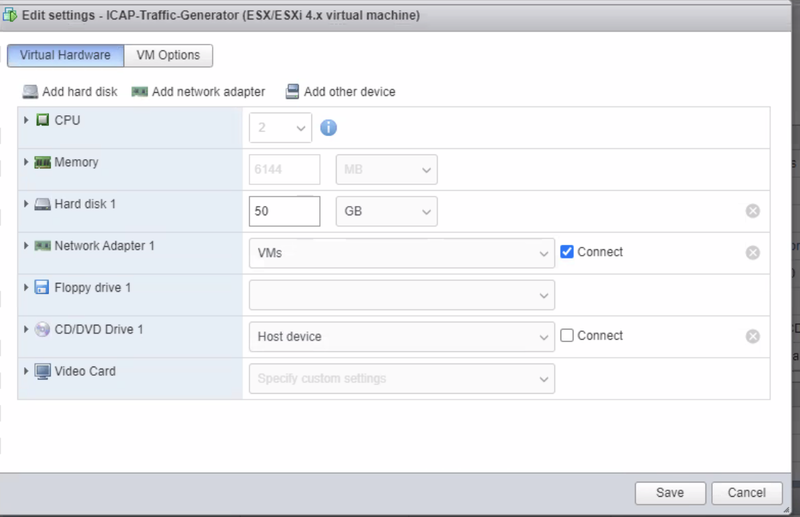

## Traffic Gen OVA Import

Step 1. Download OVA from https://glasswall-sow-ova.s3-eu-west-1.amazonaws.com/vms/Traffic-Generator/Traffic-Generator.ova

Step 2. Login to VMware and 

Step 3. Create new VM from OVA:



Step 4: Give Name to the VM



Step 5. Click Next until Finish button appears

Step 6. Click Finish button

Step 7. Wait until VM is ready. 

Step 8. Once VM is ready, you can modify the vCPU and Ram by shutting down the VM and then going to Actions -> Edit Settings. We recommend at least setting vCPU to 4 and 6GB of RAM.


Step 9. Login to VM with glasswall/glasswall credentials and remember to change password

Step 10. 

- Identify available network interface
  
  ```sh
   # ip link show

   1: lo: <LOOPBACK,UP,LOWER_UP> mtu 65536 qdisc noqueue state UNKNOWN mode DEFAULT group default qlen 1000
    link/loopback 00:00:00:00:00:00 brd 00:00:00:00:00:00
   2: ens32: <BROADCAST,MULTICAST,UP,LOWER_UP> mtu 1500 qdisc fq_codel state UP mode DEFAULT group default qlen 1000 link/ether 00:0c:29:00:22:80 brd ff:ff:ff:ff:ff:ff
  ```
- Enable the network interface

```sh

# sudo ifconfig ens32 up
```

- Add below content(reference) to `/etc/netplan/50-cloud-init.yaml`. Mention your network interface name, IP address and gateway.  

```yaml
network:
    ethernets:
        ens32:
            addresses: [91.109.25.86/27]
            gateway4: 91.109.25.94
            nameservers:
              addresses: [8.8.4.4,8.8.8.8]
    version: 2
```
- Disable `cloud-init` network config by creating file `99-disable-network-config.cfg` in   `/etc/cloud/cloud.cfg.d/` folder and insert below lines into the file. 

```json
network: {config: disabled}
```

- Once done run below commands to apply network changes

```sh
# netplan apply
# reboot
```

Step 11. Run the following shell script to change IP address to correct places:

```bash
cd /opt/script
sudo ./changeIP.sh
```
Next, please, follow https://github.com/k8-proxy/aws-jmeter-test-engine/blob/master/jmeter-icap/instructions/How-to-Generate-Load-with-OVA.md this to be able to generate load.
