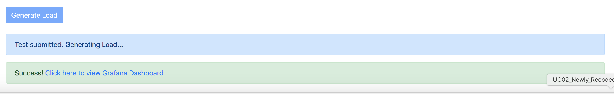
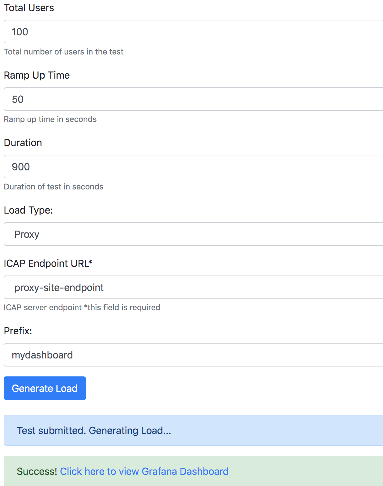
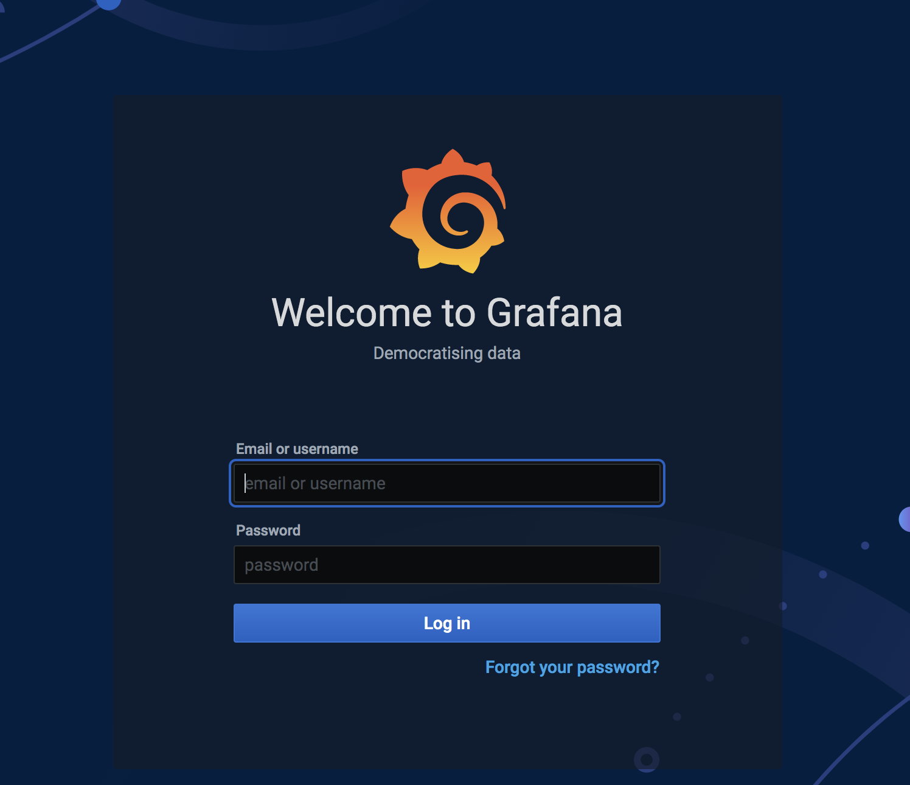
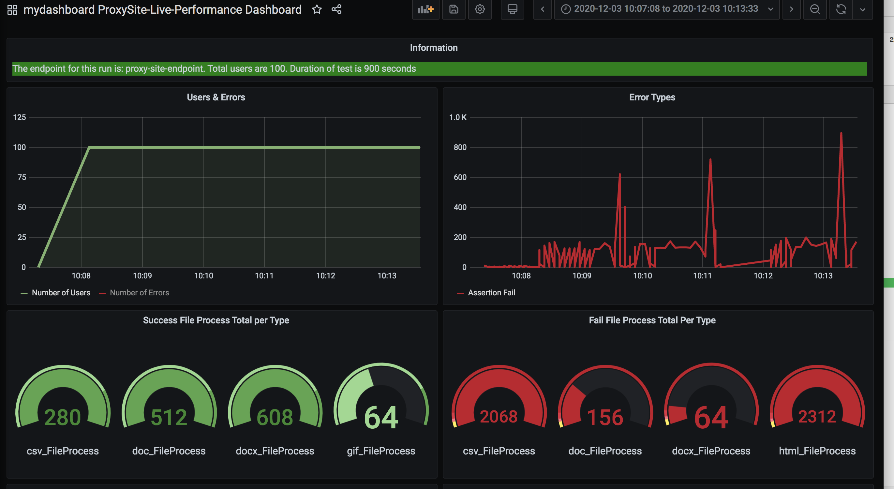

## Traffic Gen OVA Usage

# How to generate load with OVA ?

This instruction assumes that Load Generator OVA is deployed to Vmware as Virtual Machine using provided instructions. See this link how to deploy OVA: https://github.com/k8-proxy/aws-jmeter-test-engine/blob/master/jmeter-icap/instructions/How-to-Deploy-OVA.md

The following diagram shows generic view of what processes are running and how are they connected:

The load/traffic generator comes with 2 features:

- Load Generation Capability
- Performance Dashboard

## 1. How to use load/traffic generation capability

Load generation can be triggered via provided UI interface.

UI interface looks like this and accessible via http://give-virtual-machine-ip

The Load Generator UI form has the following options:

- Total Users: 
    - How many total concurrent requests would you like to send? Default: 25
    - Maximum number of total users depends on the Virtual Machine resources:

| vCPU     | RAM | Total Users    | 
| :----:   | :----:   |    :----: |
| 2-4      | 2-4 GB     | 50-500   |
| 4-6  | 8-16  GB      | 500-1000| 
| 8+ | 32+  GB      | 4000| 

- Rampup time: How fast you would like to ramp up total users? Default is 300.
- Duration: How long would you like to generate load? Default is 900
- Load Type: It is possible to generate load directly to ICAP Server or to a Proxy site
- TLS and TLS Ignore Cert Errors: These settings will enable/disable TLS and ignoring of certification errors. Default is both values are on. 
- ICAP/Proxy end point URL: end point url against which load should be run. 
   - **Note** For proxy case, url should be added only to be able to display in dashboard. currently, it runs against only gov.uk offline site and meant for demo purposes only.
- Port: ICAP Server port. For TLS default port is 443. For non-TLS default port is 1344
- Prefix: prefix is used to distinquish different dashboards and measurements. For different kind of load scenarios it is good to use their own prefix so that dashboard view would be unique for that specific scenario

## How to generate load?

Load generation process is simple:

- Ensure that target application under test is up and running
- Open browser and access Load Generation UI http://virtual-machine-ip
- Enter load scenarios based on above description
- Click on Generate Load
- Dashboard link will be shown in the page

## How to use performance dashboard?

After you click Generate Load button, dashboard link for that specific prefix will be shown in the page.

Click that link and it will open dashboard login page:

Enter admin/glasswall and then dashboard ui will be visible with your own set prefix:

**Note**: Ensure that only one test scenario is running at a time. 

**Note**: Log panel in performance dashboard will show traffic log lines in coming releases.

**Note**: if you would like to stop the test, ssh to VM and find the java process pid , for example, by "top| grep java" commmand and kill it "sudo kill pid"

**Note**: Instructions video can be downloaded from https://github.com/k8-proxy/GW-proxy/blob/master/OVAs-creation/OVA-Videos/ICAP-Performance-Traffic-Generator.mp4

---
---