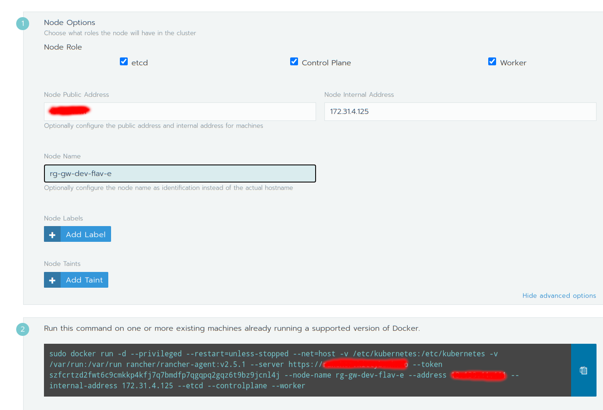

## Requirements
### Client Machine tools
  - **kubectl** https://kubernetes.io/docs/tasks/tools/install-kubectl/
  - **aws cli**  https://docs.aws.amazon.com/cli/latest/userguide/install-cliv2.html
  - **docker**  https://docs.docker.com/engine/
  - **helm** https://helm.sh/docs/intro/install/

### AWS requirements
   - An IAM user with **SystemAdministrator** policy attached. If yuo don't have permission to change Policies or create ECR repository contact the administrator.


## Setting up AWS Resource Group

1. Open the Resource Group console at https://console.aws.amazon.com/resource-groups
2. In **Create Resource Group**, select Tag Based.
3. Add two tags with: 
    
    1. Key rg-gw-dev leave optional tag value blank
4. These will be used later when creating EC2 instances for rancher and k8s
    
5. Add group name then choose **Create Group**


## Setting up AWS EC2 instance for Rancher for Flavor E

1. Open the EC2 console at https://console.aws.amazon.com/ec2/
2. Click on instances
 
3. Launch instances
 
4. In **Step 1: Choose an Amazon Machine Image (AMI)**, Select **Ubuntu Server 20.04 LTS (HVM), SSD Volume Type**.
 
5. In **Step 2: Choose an Instance Type**, For Flavor E, We went with t3a.medium because of the minimum requirement for Rancher  choose **Next: Configure Instance Details**.
 
6. In **Step 3: Choose an Instance Type**, Leave everything to default and choose **Next: Add Storage**.
 
 
7. In **Step 4: Add Storage**, change size to 30GB then choose **Next: Add Tags**
 
8. In **Step 5: Add Tags**, add a tags. 
      1. with **key rg-gw-dev and name rancher** i.e the tag we added in our Resource Group. The tag should match the one you created in Resource Group since we are using Resource Group based on tags
      2. with **key Name and name rancher**
   Choose **Next: Configure Security Group**
 
9. In **Step 6: Configure Security Group**, select Create a new security group if not previously created. Give the name and description for the security group. Leave everything to default and choose **Next: Review Instance Launch**
 
10. In **Step 7: Review Instance Launch**, review everything and **Click on Launch**
11. Download the key pair to ssh into the server later. If you don’t download the keypair now you won’t be able to in the future
 
12. Launch instances
  

## Associate Elastic IP to Rancher Instance
The public ip AWS assings isn't persistent and will change everytime you shutdown the instace.So, you'll need to set-up an Elastic IP.
1. Open the EC2 console at http://console.aws.amazon.com/ec2
2. Select **Elastic IP** and click on **Allocate Elastic IP address**
   
3. Choose **Allocate**
   
4. Select the newly created Elastic IP, choose actions then choose **Associate IP address**
   
5. Select the Rancher instance and select the private ip that has been associated with the rancher instance.Choose **Associate**
   


## Setting up Route 53 for Rancher Instance 
**The following steps are done using the old console. Switch to the old console before proceeding.**
1. Open the Route 53 Console https://console.aws.amazon.com/route53
2. Select **Hosted Zone**
   
3. Click on **Create Hosted Zone** and enter your domain name you want to use for the AWS instances
4. Copy the NS value and follow the process of your registrar for the domain to change the name servers of your domain to user the four Route 54 name server that you got after step 3.
   
5.  Then we need to create an A record for the Rancher instance. Click on **Create Record Set**
   
6.  Add a subdomain or leave it blank. Select **Type: A - IPv4 address** if not previously selected and type in the Elastic IP retrieved from https://k8-proxy.github.io/k8-proxy-documentation/docs/flavors/flavor-a/manual-setup-aws#associate-elastic-ip-to-rancher-instance  in **value**.
   
7. Click on **Create**
8. Select the newly created a record and Click on **Test Record Set** to check if the record is working or not.
   
9. Click on **Get Response**. You'll see **DNS response code:  NOERROR** if it's working. 
   


## IAM user for Rancher
1. Open the IAM user console http://console.aws.amazon.com/iam
2. Click on Users
   
3. Click on **Add User**
4. Give name to the group and select **Programmatic access**, choose **Next: Permissions**
   
5. Click on Create Group 
   
6. Type in the name of the group and search for **AmazonEC2FullAccess** and select it then click on **Create group**
   
7. Select the newly created group, choose **Next: Tags**
8. Add tags for the user i.e key rg-gw-dev name rancher-user, choose **Next: Review**
   
9. Review then choose **Create User**
10. Download the CSV or save the Access key ID and Secret access key which will be used later for rancher
   
11. Close

## Setting up Rancher
### Before following the Rancher Docs
It is highly advised to have a domain for the Rancher instance or you'll be facing tons of issues.
Use the **Access key id** and **Secret access Key** that was retrieved in https://k8-proxy.github.io/k8-proxy-documentation/docs/flavors/flavor-a/manual-setup-aws#iam-user-for-rancher when Rancher asks for it.
After you have everything required follow the steps below:
1. SSH to Rancher instance using the keypair that you retrieved from https://k8-proxy.github.io/k8-proxy-documentation/docs/flavors/flavor-a/manual-setup-aws#setting-up-aws-ec2-instance-for-rancher-for-flavor-a
    
2. Install docker
   ```
   sudo apt-get update
   sudo apt-get install apt-transport-https  ca-certificates  curl  gnupg-agent software-properties-common
   curl -fsSL https://download.docker.com/linux/ubuntu/gpg | sudo apt-key add -
   sudo apt-key fingerprint 0EBFCD88
   sudo apt-get update
   sudo apt-get install docker-ce docker-ce-cli containerd.io
   ```
3. Deploy rancher server using docker
   ```
    docker run -d --restart=unless-stopped \
    -p 8080:80 -p 8443:443 \
    --privileged \
    rancher/rancher:latest \
    --no-cacerts
    ```
4. Install Apache2 and enable proxy and rewrite
   ```
    sudo apt-get install apache2
    sudo a2enmod proxy proxy_http proxy_wstunnel proxy_balancer proxy_connect headers
    sudo a2enmod rewrite 
    sudo systemctl restart apache2
   ```
5. Edit the vhost conf file. Replace the  your-rancher-domain with domain configure in https://k8-proxy.github.io/k8-proxy-documentation/docs/flavors/flavor-a/manual-setup-aws#setting-up-route-53-for-rancher-instance 
   ```
   sudo vi /etc/apache2/sites-available/000-default.conf
   ```
   Change it to 
   ```
   <VirtualHost *:80>
    ServerName <your-rancher-domain>
    ProxyRequests Off
    ProxyPreserveHost On
    RewriteEngine On
    RewriteCond %{HTTP:Connection} Upgrade [NC]
    RewriteCond %{HTTP:Upgrade} websocket [NC]
    RewriteRule /(.*) ws://0.0.0.0:8080/$1 [P,L]
    RequestHeader set X-Forwarded-Proto "https"
    RequestHeader set X-Forwarded-Port "443"
    <Location />
      ProxyPass "http://0.0.0.0:8080/"
      ProxyPassReverse "http://0.0.0.0:8080/"
    </Location>
    ErrorLog ${APACHE_LOG_DIR}/rancher-website-error.log
    CustomLog ${APACHE_LOG_DIR}/rancher-website-access.log combined
   </VirtualHost>
   ```
6. Save and restart apache2
   ```
     sudo systemctl restart apache2
   ```
7. Install certbot https://certbot.eff.org/lets-encrypt/ubuntufocal-apache and run 
   ```
   sudo snap install core; sudo snap refresh core

   sudo snap install --classic certbot

   sudo ln -s /snap/bin/certbot /usr/bin/certbot

   sudo certbot --apache
   ```
8. Select the domain that you added in your vhost

**If you don't want the IP to change everytime the instance gets rebooted or shutdown then Elastic IP is recommended.**
### For instance with dynamic public IP
1. Open your rancher domain and follow from step 2. from the link https://github.com/k8-proxy/s-k8-proxy-rebuild/blob/master/stable-src/README.md#installation-steps-to-deploy-k8s-cluster-on-ec2-instances-using-rancher
2. A new instance will be created in EC2 instance console.
### For instance with Elastic IP(Recommended)
1. Follow these steps but instead of rancher, it's for Flavor E. So change the tags from **rg-gw-dev: rancher** and **Name: rancher** to
   **Name: Flavor-a** and **rg-gw-dev: Flavor-a** 

   #### Important
   When in the **Security Group** section don't forget to open up the required ports for Rancher. https://rancher.com/docs/rancher/v2.x/en/installation/requirements/ports/
   
   

      1. https://k8-proxy.github.io/k8-proxy-documentation/docs/flavors/flavor-a/manual-setup-aws#setting-up-aws-ec2-instance-for-rancher-for-flavor-a
      2. https://k8-proxy.github.io/k8-proxy-documentation/docs/flavors/flavor-a/manual-setup-aws#associate-elastic-ip-to-rancher-instance

2. Open your rancher domain.
3. Select **Add Cluster**
4. Select **Existing Node**
5. Name the Cluster rg-gw-dev-flavor-a
6. In **In-Tree Cloud Provide**, choose **Custom**
    

7. Click on **Next**
8. Select **etcd**, **Control Plane**, **Worker**
    
    
9. Click on **Show advanced options**
10. Enter the **Node Public Address**(Elastic IP), **Node Internal Address**(Private IPv4 addresses), **Node Name**(The value you added in as Name as tag when creating the EC2 instance eg. if you have a key Name and the value is set to flavor-a, use flavor-a), which can be found in instance details tab when you select the newly created instance in the EC2 console.
    
11. Copy the docker command.
11. SSH to the instance using the keypair that you retrieved in step 1.
12. Install docker
    ```
    sudo apt-get update
    sudo apt-get install apt-transport-https  ca-certificates  curl  gnupg-agent software-properties-common
    curl -fsSL https://download.docker.com/linux/ubuntu/gpg | sudo apt-key add -
    sudo apt-key fingerprint 0EBFCD88
    sudo apt-get update
    sudo apt-get install docker-ce docker-ce-cli containerd.io
    ```
13. Paste the command and run.
14. Go to your rancher console and select done.

## Adding Tags to Security Group and k8s EC2 Instance for AWS Resource Group
### Adding tags to Security Group
1. Open the EC2 console https://console.aws.amazon.com/ec2/
2. Select **Security Groups**
3. Select a security group
4. Click on **Tags** at the bottom right.
   
5. Click on **Manage tags**.
6. Click on **Add tags** and add a tag
   
7. Click on **Save Changes**
Do the above step for all security group
### Adding tags to EC2 Instance
1. Open the EC2 console https://console.aws.amazon.com/ec2/
2. Select **Instances**
3. Select a EC2 instance
4. Click on **Tags** at the bottom right.

   
5. Click on **Manage tags**.
6. Click on **Add tags** and add a tag

   
7. Click on **Save Changes**
Do the above step for all security group


## Setting up ICAP Infrastructure
1.  Clone the https://github.com/k8-proxy/icap-infrastructure repository
    ```
        git clone https://github.com/k8-proxy/icap-infrastructure.git
    ```
    then run the following commands
    ```
    cd icap-infrastructure/adaptation
    kubectl create ns icap-adaptation
    kubectl create -n icap-adaptation secret generic transactionstoresecret --from-literal=accountName=guest --from-literal=accountKey=guest
    ```
    ####Edit the event-submission-deployment.yml and change transactionStoreSecret to transactionstoresecret(Only required for the time I am cloning this branch i.e commit id 539a0ed4da97c445bcfa27e8fa5185ccb2494d8e)

2. Follow the doc https://github.com/k8-proxy/icap-infrastructure#adaptation-cluster until the **helm install** command
3. Run the command
   ```
   kubectl get configmap/tcp-services -ningress-nginx -o yaml > tcp_services_icap3.yaml
   ```
4. Edit the yaml file
   ```
     vim tcp_services_icap3.yaml
   ```
   and add the following at the end of the fil
   ```
   data:
    "1344": icap-adaptation/icap-service:1344
   ```
5. Install c-icap
   ```
    sudo apt-get install c-icap
   ```
6. Run the command but replace the Elastic IP text
   ```
     c-icap -i <Elastic IP>
   ```

