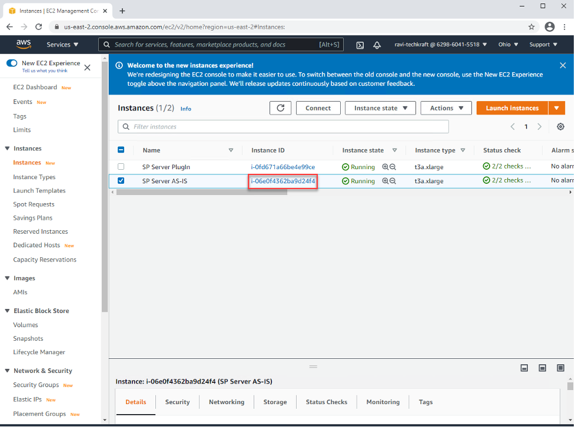
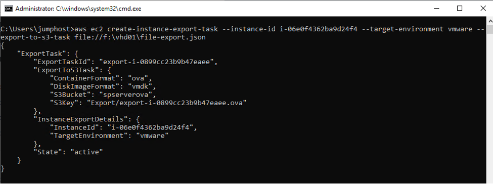
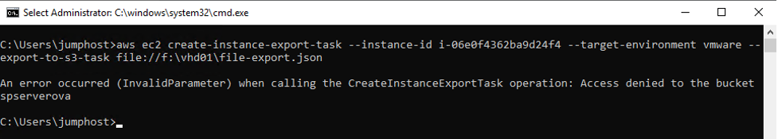
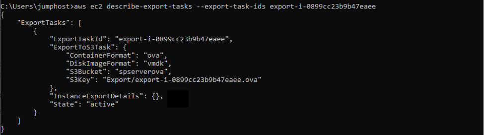
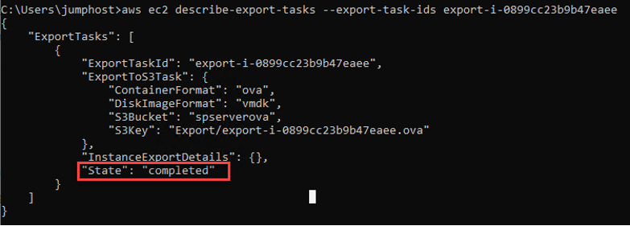
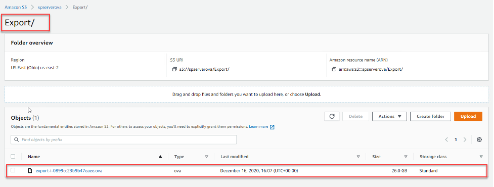

1. Select the Instance and copy ‘Instance ID’.


2. Create a json file to export instance adding below text providing the name of bucket and folder.

```
{
    "ContainerFormat": "ova",
    "DiskImageFormat": "VMDK",
    "S3Bucket": "spserverova",
    "S3Prefix": "Export/"
}
```

3. Run below cmdlet on the AWS CLI with the copied ‘Instance ID’. Also copy the ‘ExportTaskID’ to monitor the export process

```
aws ec2 create-instance-export-task --instance-id i-06e0f4362ba9d24f4 --target-environment vmware --export-to-s3-task file://f:\vhd01\file-export.json
```



If you face any issue as of below follow steps on Annex 3 to resolve it.




4. To monitor the Export task of AWS instance, run below cmdlet in AWS CLI
aws ec2 describe-export-tasks --export-task-ids export-i-0899cc23b9b47eaee




5. It will take while to complete the task, once the task is completed. You will be able to se the status as ‘Completed’.



6. Verify the ‘OVA’ file as navigating into bucket folder.

