## Version: Sharepoint 2019
## Topology: Single Server Farm
## Target: OVA in AWS

# Steps

## Pre-Requisites
Sharepoint 2019 OVA
[Follow these steps](./sp-vhd-to-ova)


## Glasswall OVA image Deployment in AWS

### Upload OVA File

Once VHD is converted into OVA, it's time to upload it into AWS storage. To upload OVA into AWS, followed below steps.

  1. Log In into AWS Portal, Search for 'S3' and open it.

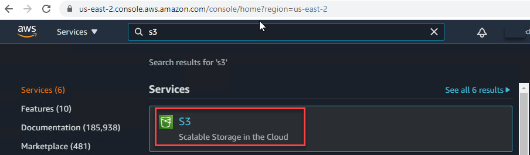

  2. Once 'Amazon S3' is open, created a bucket. Where we will be uploading our OVA file.

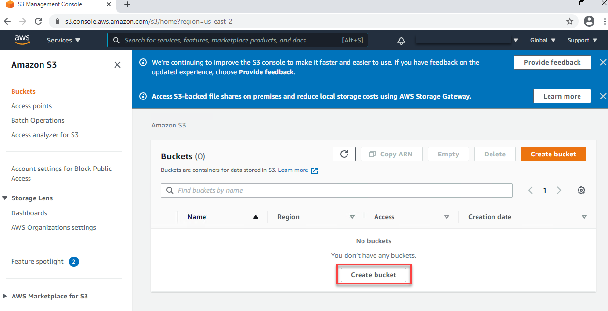

  3. Created a 'Bucket' by specificing the name of it.

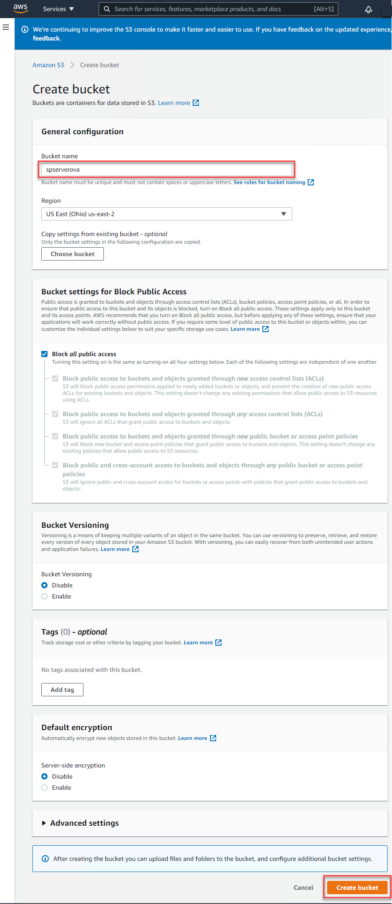

  4. Once Bucket is created, Open Bucket and clicked on 'Upload'.

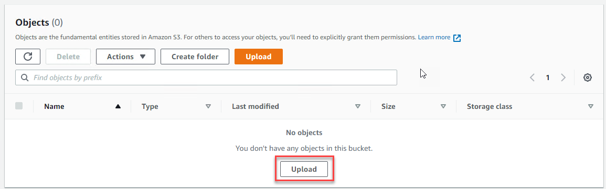

  5. On 'Upload** _', Selected 'Add Files** _'.

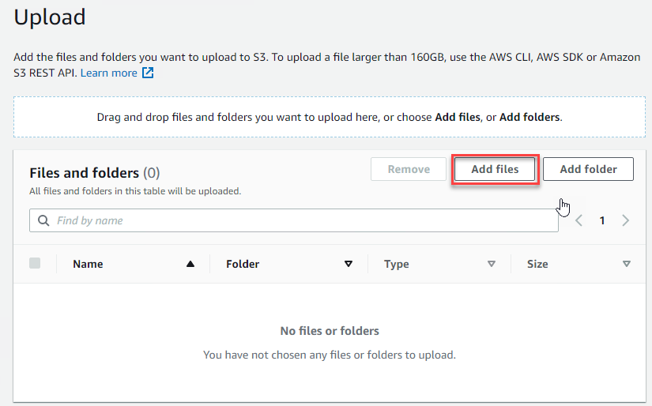

  6. Browsed the specific OVA file located in your local machine and clicked on 'Open** _'.

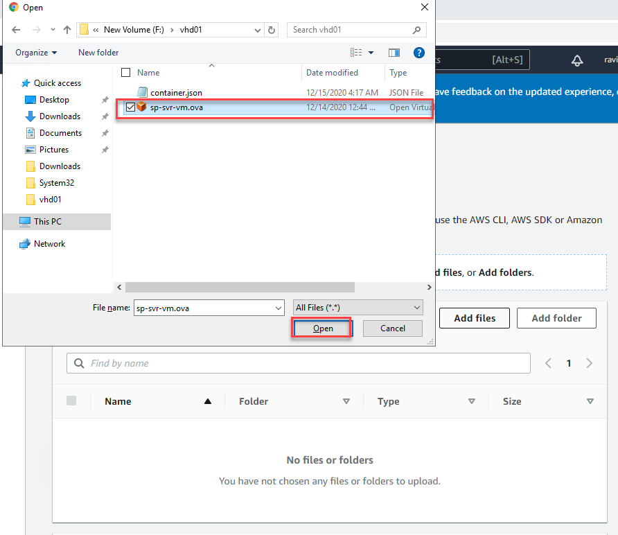

  7. Once the file is ready to upload click on 'Upload'.** _


### Import AMIs

After uploading the OVA file, now it's time to import it for the Virtual Instant. To Import the OVA into Virtual Instant, we need to install AWS CLI (Follow instruction at [ANNEX-2 Installation of AWS CLI](#_Annex-2_(Installation_of_1) to Install AWS CLI). Once CLI is installed Configure it and import below Policies.

  1. Create a file named trust-policy.json on your computer. Add the following policy to the file

```
{
    'Version': '2012-10-17',
    'Statement': 
    [
        {
            'Effect': 'Allow',
            'Principal': { 'Service': 'vmie.amazonaws.com' },
            'Action': 'sts:AssumeRole',
            'Condition': {
                'StringEquals':{
                    'sts:Externalid': 'vmimport'
                }
            }
        }
    ]
}
```

  2. Use the [create-role](https://docs.aws.amazon.com/cli/latest/reference/iam/create-role.html) command to create a role named vmimport and grant VM Import/Export access to it. Ensure that you specify the full path to the location of the trust-policy.json file that you created in the previous step, and that you include the file:// prefix as shown the following example:

aws iam create-role --role-name vmimport --assume-role-policy-document 'file://f:\vhd01\trust-policy.json'

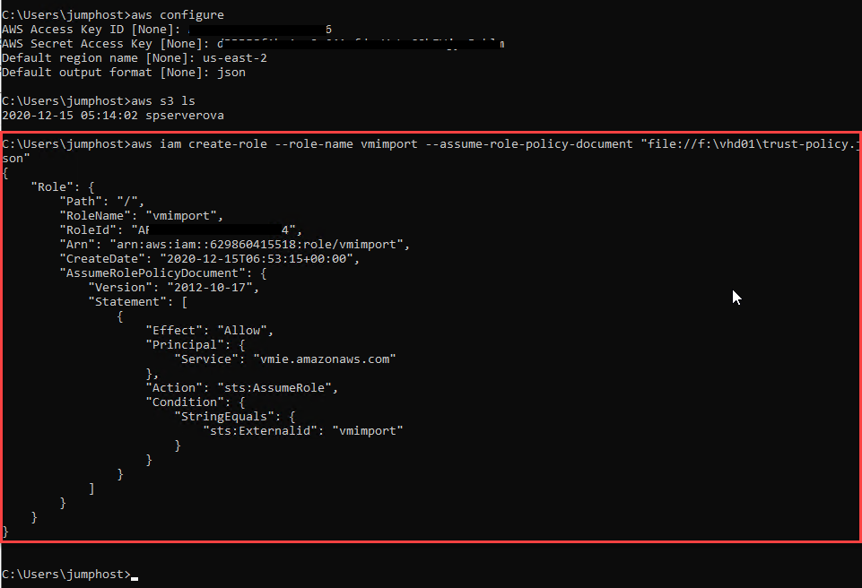

  3. Create a file named role-policy.json with the following policy, where disk-image-file-bucket is the bucket for disk images and export-bucket is the bucket for exported images

```
{
    Version':'2012-10-17',
    'Statement':[
            {
            'Effect':'Allow',
            'Action':[
                's3:GetBucketLocation',
                's3:GetObject',
                's3:ListBucket'
            ],

            'Resource':[
            'arn:aws:s3:::spserverova',
            'arn:aws:s3:::spserverova/\*'
            ]
        },
        {
        'Effect':'Allow',
        'Action':[
            'ec2:ModifySnapshotAttribute',
            'ec2:CopySnapshot',
            'ec2:RegisterImage',
            'ec2:Describe\*'
        ],
        'Resource':'\*'
        }
    ]
}
```

  4. Use the following [put'-role-policy](https://docs.aws.amazon.com/cli/latest/reference/iam/put-role-policy.html) command to attach the policy to the role created above. Ensure that you specify the full path to the location of the role-policy.json file.

aws iam put-role-policy --role-name vmimport --policy-name vmimport --policy-document 'file://f:\vhd01\role-policy.json'

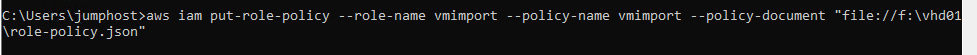

  5. Once the policy has been imported, Created a container.json file as of below text.

```
[
    {
        'Description': 'SP Server OVA',
        'Format': 'ova',
        'UserBucket': {
            'S3Bucket': 'spserverova',
            'S3Key': 'sp-svr-vm.ova'
        }
    }
]
```

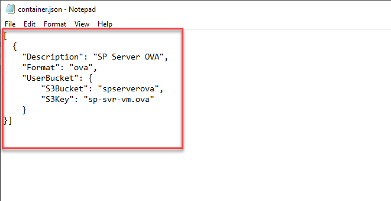

  6. After creating 'container.json' user below cmdlet to import image.

aws ec2 import-image --description 'SP Server OVA' --disk-containers 'file://f:\vhd01\container.json'

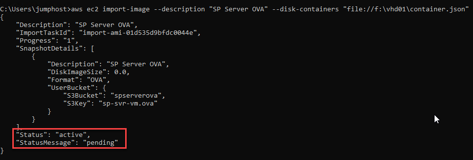

  7. You can check the status of the of importing image using below cmdlet

aws ec2 describe-import-image-tasks --import-task-ids import-ami-01d535d9bfdc0044e

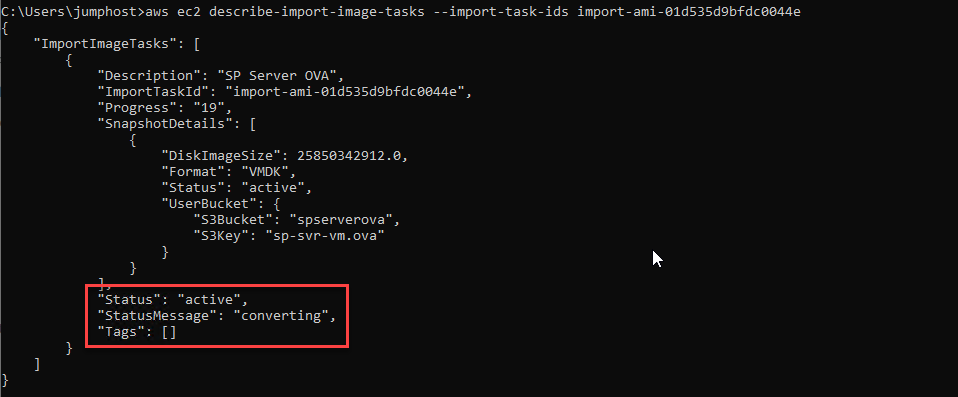

  8. Check until you do have status as of below, it should show status as completed.

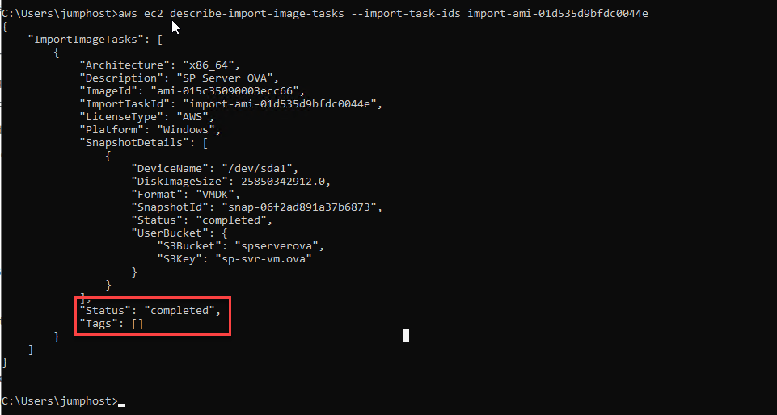

  9. Once the status is completed, you will be able to see imported instance under 'AMIs'.

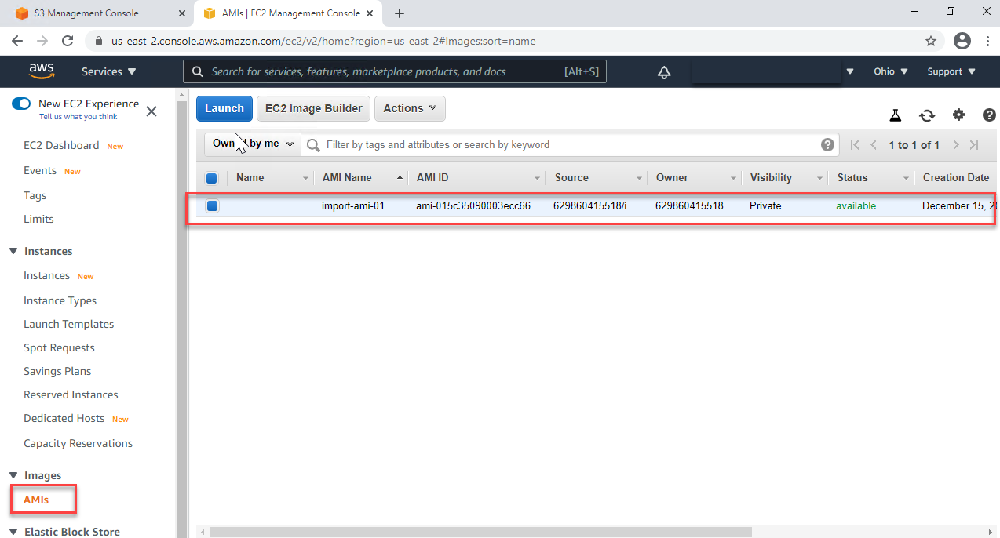


# Launch Instance

Once the image is available in 'AMIs', we can start with Launching Instance. Follow below steps to Launch Instance.

  1. On the 'AMIs' , select the machine and clicked on 'Launch'.

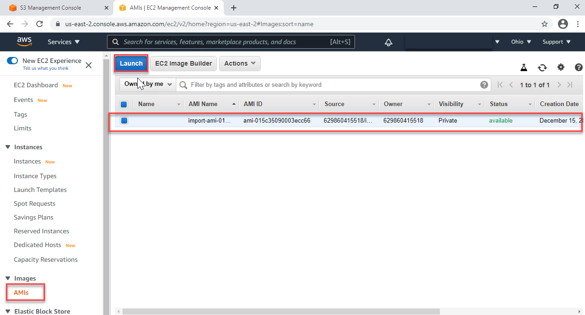

  2. Selected the Instance specs as of in Azure and clicked on 'Review and Launch'.

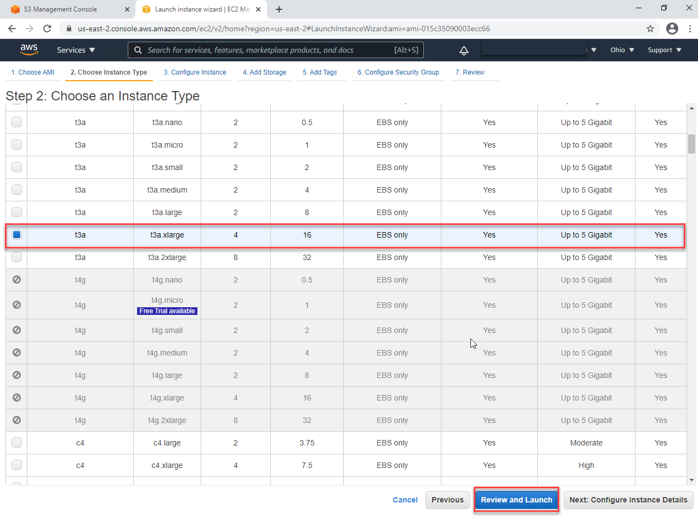

  3. Validated the Instance configuration and clicked on 'Launch'.

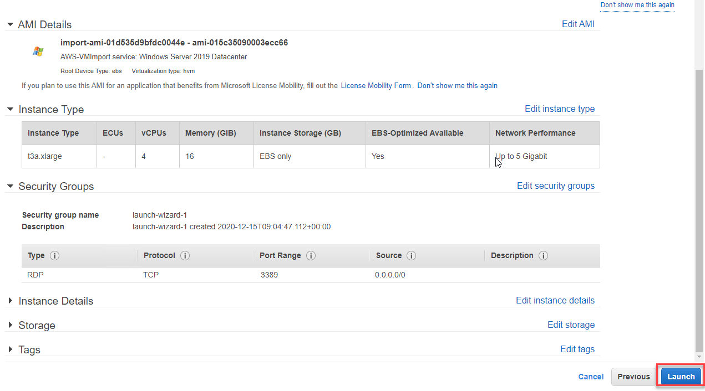

  4. On the key pair type selected 'Proceed without a key pair' _to get authenticated with domain credentials on the machine. And selected on'Launch Instances'.**


  5. It will take while to launch you instance, to view the status of instance click on 'View Instances'.

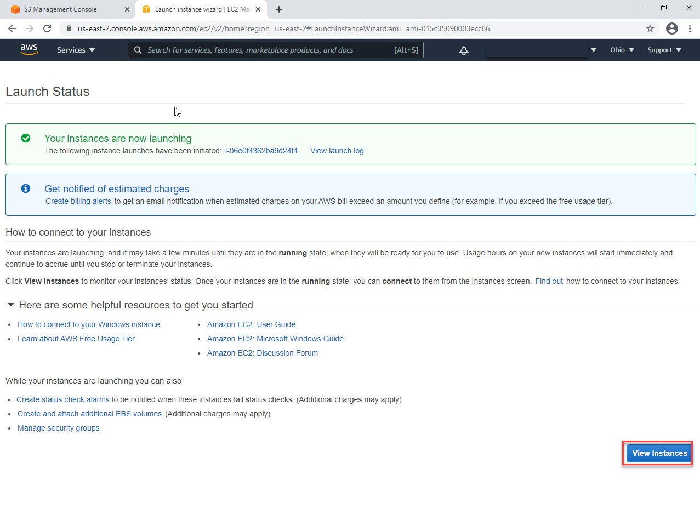

  6. Once the 'Instance state' is 'Running', click on 'Action' and connect Instance.

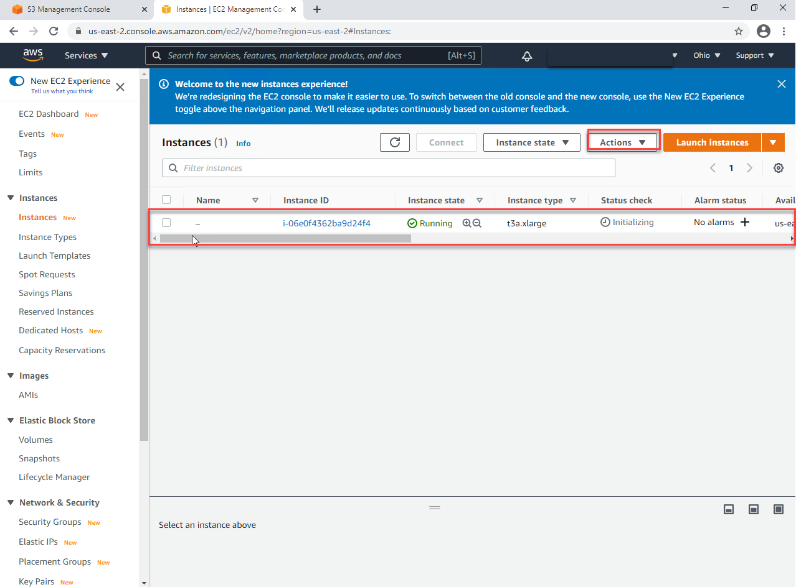