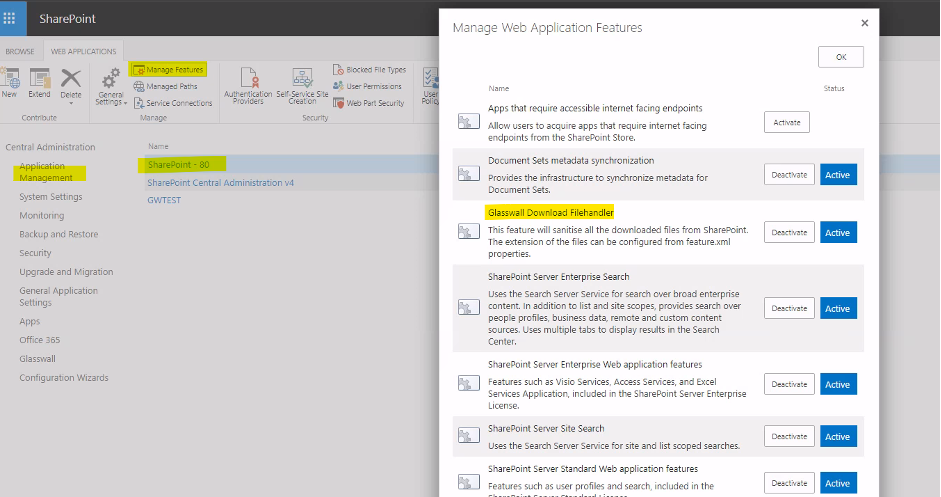
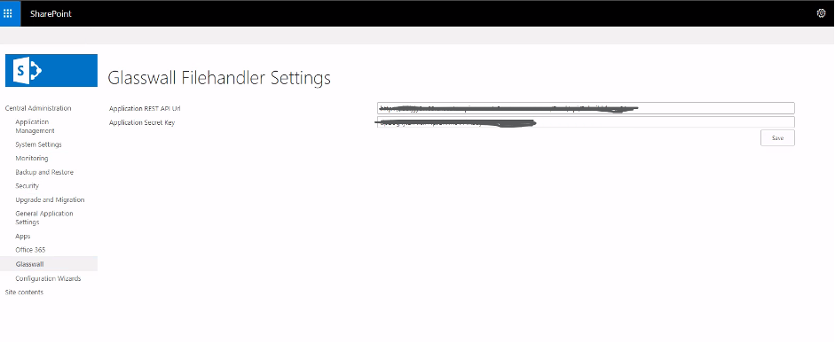
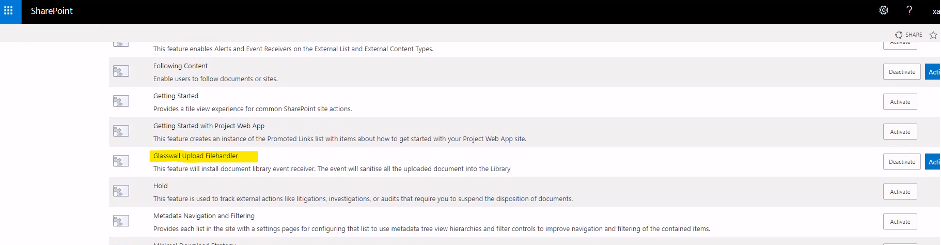
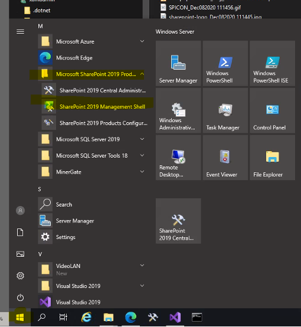
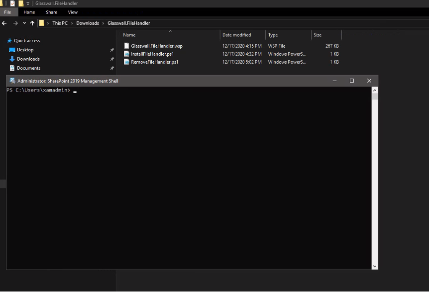
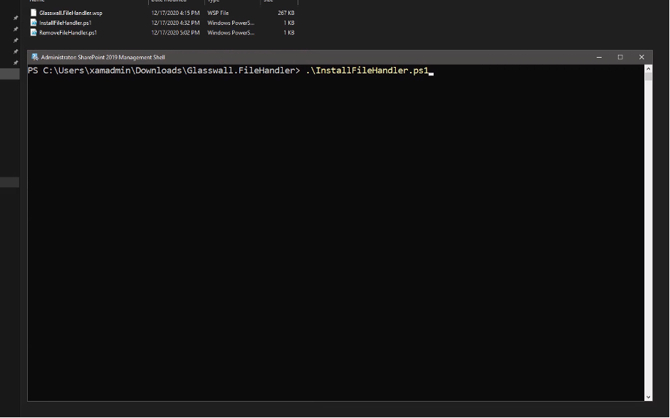
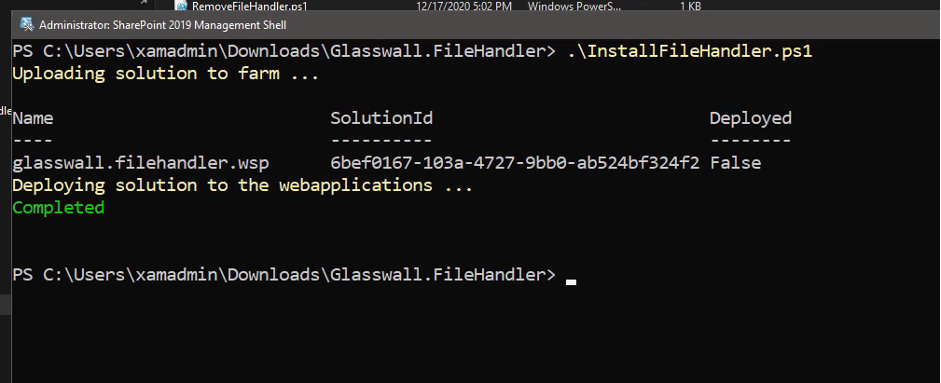

## Overview

The Sharepoint Self-Hosted plugin allows to delegate all download and uploads activities in the SharePoint User Interface to the GlassWall Rebuild engine. This keeps the all sharepoint documents safe.

[Plugin Brochure](https://github.com/k8-proxy/gp-sharepoint-plugins/blob/main/SelfHosted/doc/SharePointCloudPlugin-v1.pdf)

### Repository

1. get the latest install and scripts by cloning the [Repo](https://github.com/k8-proxy/gp-sharepoint-plugins.git) 

## Installation Guide

### Introduction 

This document provides the step-by-step installation guide. This installation procedure is for only SharePoint 2019 On Prem. The installation of Glasswall.FileHandler.wsp will activate several Feature within the SharePoint web and Central Administration. Below are the changes:

1. Web Application level Feature Activation.

2. Central Administration Feature for Custom Settings

3. Web level document library Event Receiver

### Installation Files 

The zip file Glasswall.FileHandler.zip contains below files for the installation
1. Glasswall.FileHandler.wsp
2. InstallFileHandler.ps1
3. RemoveFileHandler.ps1

### Installation Steps 

1. Login to the SharePoint Server where the Central Administration is installed. In the multiple server farm environment login to the Application Server. The account used to login should be the farm Admin account and have local server administrator.
2. Copy the zip file Glasswall.FileHandler.zip to the SharePoint Server under the folder. Ex: Downloads folder
3. Unzip the Glasswall.FileHandler.zip file to the local folder. If it is under downloads folder a new folder is created with Glasswall.FileHandler and all files will be unzipped to that folder.
4. Locate the file InstallFileHandler.ps1. Copy the location.
5. Click on Start->Microsoft SharePoint 2019 Products->SharePoint 2019 Management Shell. This will open the PowerShell terminal for SharePoint 2019

6. In the command prompt paste the location of the unzipped location. 
Ex: cd C:\Users\USERNAME\Downloads\Glasswall.FileHandler and change the directory to the location.

7. Type the file name InstallFileHandler.ps1 and press enter to install the wsp. This command will install and activate all the feature.

After successful installation, the features will be activated.

[Watch the video](../../../../static/video/docs/websites/sharepoint/self-hosted/wsp-install.mp4)

